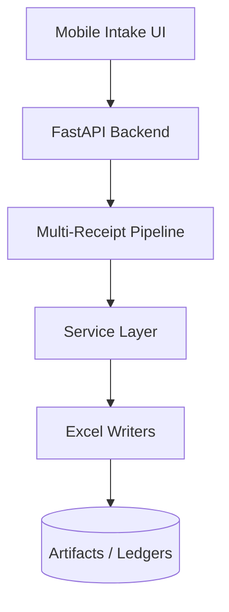

# Architecture Overview

This document captures the high-level system layout for the multi-engine receipt OCR platform. The goal is to establish clear seams for future development while leaving detailed behavior for later contracts.

## System Context

## Layered Responsibilities

1. **API Layer** – Handles ingestion, validation, and submission history tracking.
2. **Pipeline Layer** – Orchestrates OCR engines, mapping, validation, and exports.
3. **Service Layer** – Encapsulates business-specific operations (mapping, validation, summaries, duplicates).
4. **Excel Layer** – Writes ledgers, summaries, and exports.
5. **Artifacts / Storage** – Persists uploads, logs, templates, and Excel outputs.

## TODO

- [ ] Expand component interactions with sequence diagrams.
- [ ] Document deployment topology and scaling assumptions.
