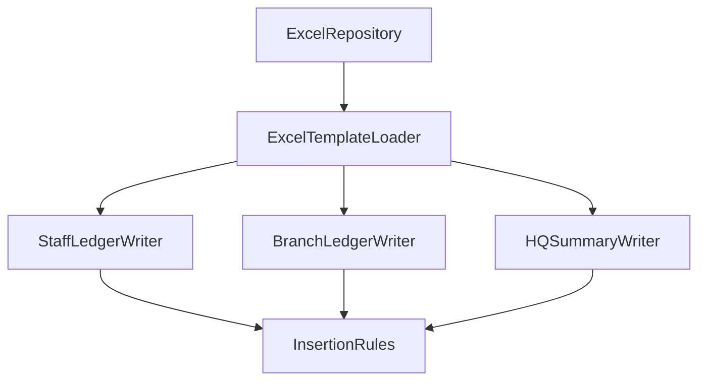

# Excel Formats Overview

High-level view of the upcoming Excel outputs and writers.

## Ledgers

- **Staff Ledger (Format ①)** – Per-staff register with chronological receipt entries.
- **Branch Ledger (Format ②)** – Aggregated per-branch sheets for manager review.
- **HQ Summary** – Consolidated totals feeding HQ reporting.

## Writer Relationships

## TODO

- [ ] Define template naming conventions.
- [ ] Document worksheet protections and formatting rules.
- [ ] Clarify Excel version compatibility.
