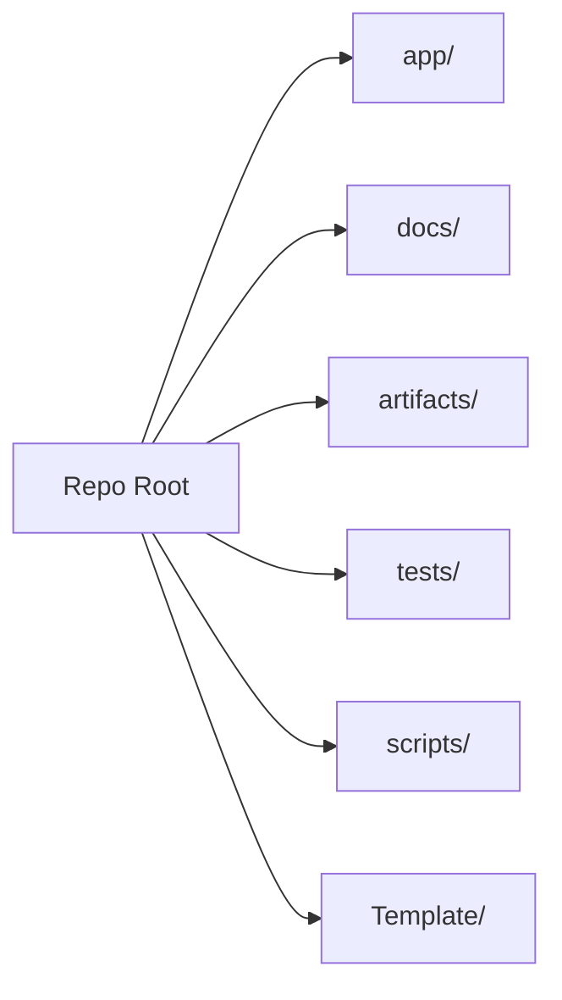

# Folder Structure

This guide outlines the evolving directory taxonomy for the project.

## Highlights

- `app/` – Core application code (API, services, pipeline, OCR, Excel writers).
- `docs/` – Architectural references, onboarding guides.
- `artifacts/` – Non-source outputs (uploads, logs, exports).
- `tests/` – Automated validation suites.
- `scripts/` – Operational utilities.
- `Template/` – Master Excel templates managed outside the code flow.

## TODO

- [ ] Document retention policy for `artifacts/`.
- [ ] Add per-folder ownership and review notes.
