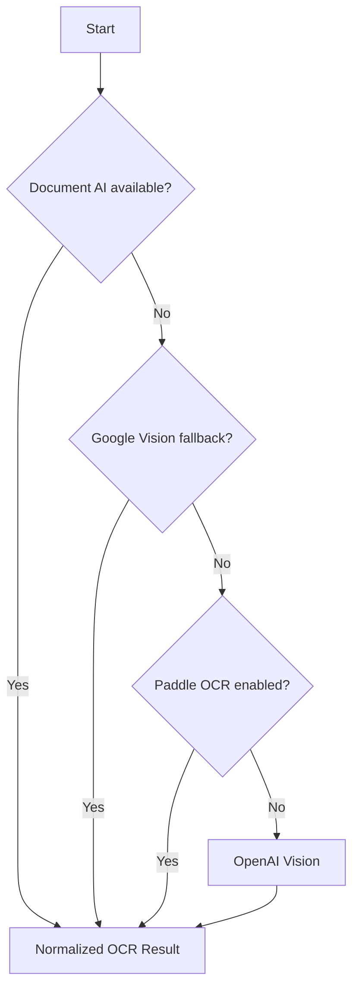

# OCR Engine Overview

This document summarizes the multi-engine strategy (Document AI, Google Vision, PaddleOCR, OpenAI Vision, etc.).

## Engine Selection Flow

## TODO

- [ ] Capture latency & confidence heuristics per engine.
- [ ] Document merge strategies and weighting.
- [ ] Outline governance for API keys.
