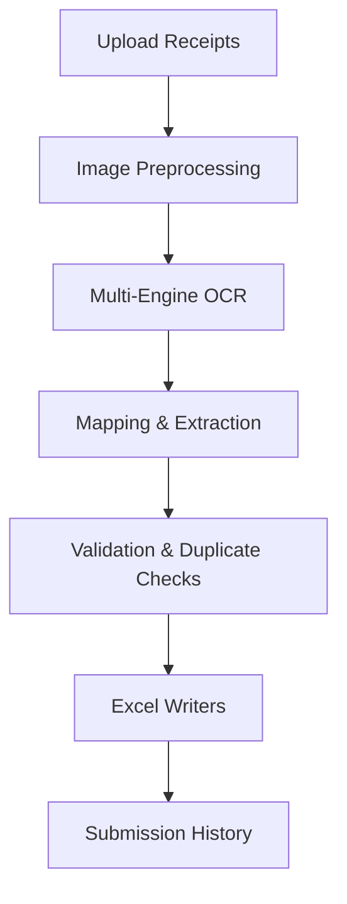

# Pipelines Overview

This document captures the planned pipelines for single and multi-receipt processing.

## Receipt Intake Flow

## Batch Pipeline Considerations

- Sequential placeholder pipeline (`MultiReceiptPipeline`) stands in until concurrency strategy is defined.
- Background tasks should queue file-level work with telemetry hooks.
- Submission history must record batch + per-file states.

## TODO

- [ ] Add error-handling and retry flows.
- [ ] Define metrics/observability plan per stage.
