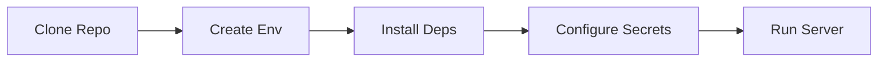

# Setup Guide

High-level reference for preparing local environments. Detailed steps will be added later.

## Prerequisites

- Python 3.11+
- Node.js (for optional tooling)
- Access to Google Document AI, Google Vision, and other OCR credentials

## Initial Steps

1. Clone the repository.
2. Create a virtual environment (naming TBD) and install dependencies from `requirements.txt`.
3. Configure environment variables + secrets files under `config/`.
4. Launch the FastAPI server via `start_server.py` or equivalent.

## TODO

- [ ] Add platform-specific scripts and screenshots.
- [ ] Document SSL setup for https endpoints.
- [ ] Include troubleshooting section.
